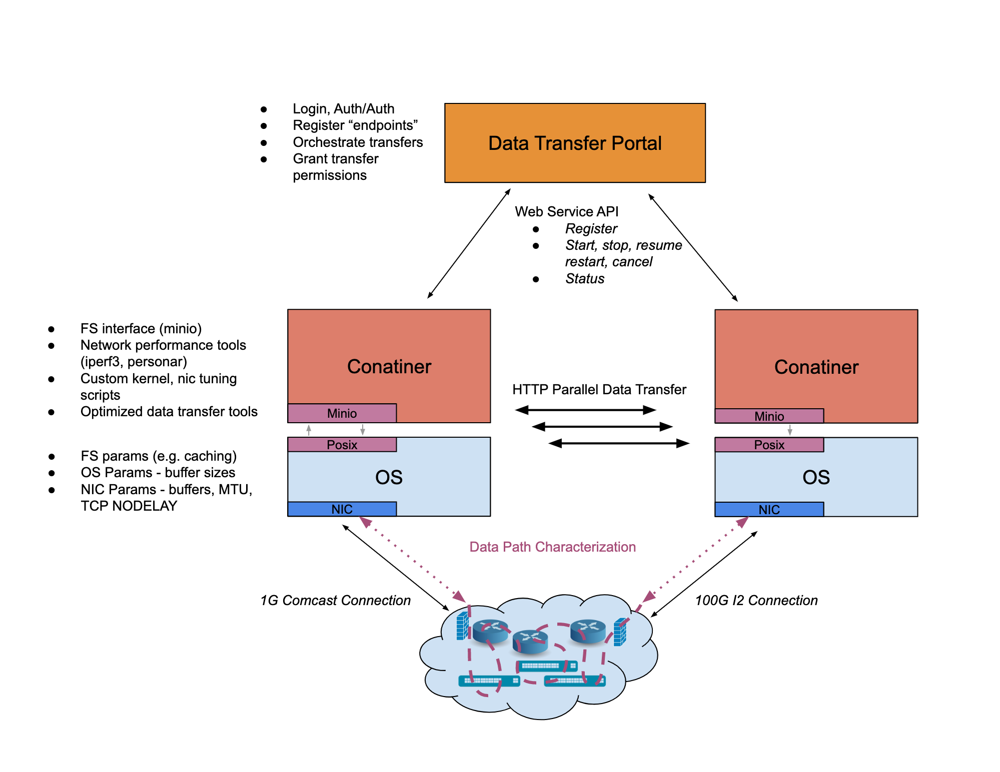

# Data-Transfer-Node-in-a-Box

# 1. Vision and Goals Of The Project:

We are reaching a point in science where our ability to generate and collect experimental data is outstripping our ability to move, store and reliably retrieve it. To realize the maximum impact of trillions of dollars of global research the results from those experiments need to be accessible to as wide a community as possible. Whereas research results in the past were neatly summarized in research papers totaling kilobytes, modern research generates artifacts that are an order of a billion times larger (petabyte scale). While storage and networking hardware have advanced apace with this torrent of data, their orchestration - the ability to share and move large datasets globally - lags painfully.

The project aims to make large data transfers less painful for the end users of ScienceDMZ and focuses on the following:
   * Users must have a way of packaging their data(ScienceDMZ and DTNs) into a container collection.
   * Users must have access to a portal where they can register their packaged containers and coordinate their data transfers.
   * Transfers must work in a reasonably fast and reliable manner, with some kind of network checking/monitoring before and during the moving of data.

# 2. Users/Personas Of The Project:

This project is targeting people who are dealing with large data sets and have a need for sharing and moving large datasets globally.
   * Normal Users: This project targets end-users of MOC (Mass Open Cloud) who are unable to build Science DMZs themselves but are in need of giant data           transferation. Users can register and then login to get access to the packed containers which they can download and use as tools to realize timely data moving. 
   * System administrator: For system administrators of MOC to achieve performance only currently attainable by the most skilled.
   * Network administrator: The application would be dealing with network configuration and tuning. A network administrator would be required to ensure that the parameters for network performance are maintained and set appropriately.

# 3. Scope and Features Of The Project:

The solution would be presented as a Proof of Concept where the team plans to create a technology backlog to learn the technologies required for the project. Such as learning how to create containers and using services such as MinIO.
  *   Presents a simple compelling interface for end-users.
    * Addition and management of users of the system.
    * Ability to create containers of data.
    * Option to initiate, stop and restart container transfer.
    * Option to evaluate network parameters.
  *  Integration of perfSonar for network performance
  * Evaluation of Docker and OpenShift for creating data containers.
    * Create container using the evaluated platform
          
The team will be evaluating if it is possible to include performance tuning on OS and network level in the scope of the project based upon experimentation results and the fact that it is dependent upon server availability and server configuration.

# 4. Solution Concept

This project aims to use a Science DMZ to package data into a collection of containers that can be deployed by end users to get improved performance out of their storage and networking and; as a starting point for system administrators to achieve performance only currently attainable by the most skilled.
The Science DMZ is a portion of the network, built at or near the campus or laboratory's local network perimeter that is designed such that the equipment, configuration, and security policies are optimized for high-performance scientific applications rather than for general-purpose business systems or “enterprise” computing.

The solution will consist of a Data Transfer Portal which will allow users to login and start containerization of data. The containers would then be transferred over high speed networks from source to destination where it will be downloaded to the local file system. Before the transfer is initiated, the solution proposes to perform Data Path Characterization by evaluating network parameters.

The solution would be using services such as MinIO which allows a consistent, performant and scalable object store. It can handle unstructured, large data such as photos, videos, log files, container images, backups etc. The solution also uses gridFTP protocol for transfer of containers over the network.

